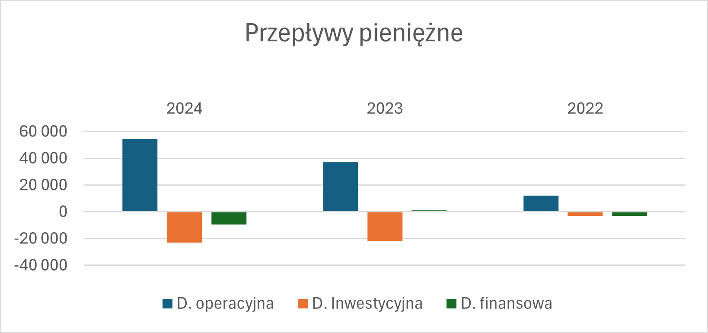
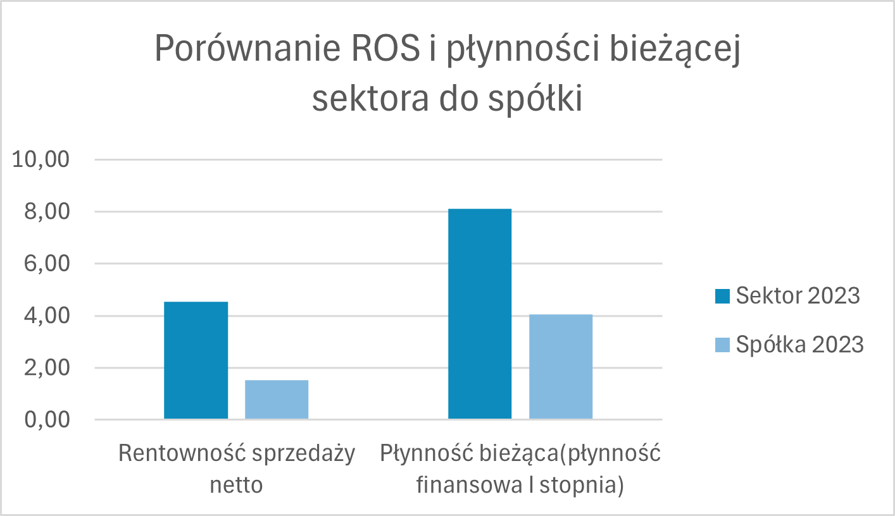
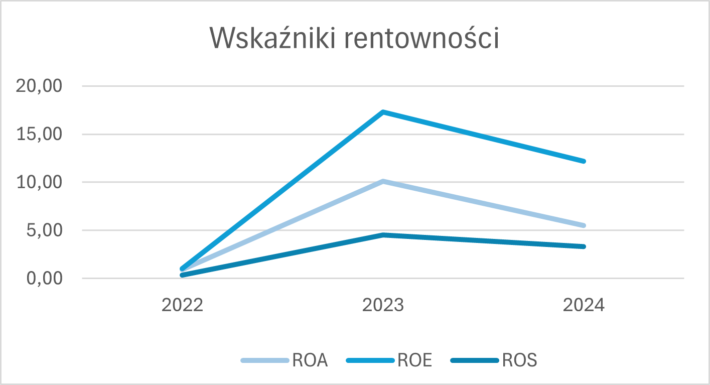

# 📊 Financial Analysis of Atende (2022–2024)
Comprehensive project for assessing the financial condition of the company, based on financial statements from 2022–2024. The analysis focuses on identifying trends, assessing risk, and the efficiency of capital management. The entire analysis is located in the xlsx file.

## Project objective
The objective of the project was to verify the financial stability of the examined entity and evaluate its potential to generate profits in the future. The report answers questions regarding liquidity security and operational efficiency.

## Scope of analysis
The analysis includes preliminary analysis (vertical, horizontal, vertical-horizontal) and four key pillars of corporate finance:

Preview of the most important sheets:
 
Cash-Flow analysis:

### 1.Liquidity
Assessment of the company's ability to settle short-term obligations in a timely manner.
* **Analyzed indicators***: Current Ratio, Quick Ratio, Cash Ratio.Ratio

### 2. Profitability
Verification of sales efficiency and capital management.
* **Analyzed indicators:** EBIT Margin, Net Margin, ROE (Return on Equity), ROA (Return on Assets).

### 3. Solvency and financing structure
Analysis of long-term security and debt levels.
* **Analyzed indicators:** * **Analyzed indicators:** EBIT Margin, Net Margin, ROE (Return on Equity), ROA (Return on Assets).
  
### 4. Operational efficiency (Activity)
Assessment of the turnover rate of receivables, liabilities, and inventory.
* **Analyzed indicators:** Total Asset Turnover, Inventory Turnover, Receivables Turnover, Days Sales Outstanding (DSO), Days Payable Outstanding (DPO), Days Inventory Outstanding (DIO).

### 5. Dynamic Ratios (Cash Flow)
Based on Net Operating Cash Flows.
* **Analyzed indicators:** Operating Cash Flow to Sales, Cash Flow to Net Income, Cash Flow Adequacy Ratio.

## Methodology and Tools
The project was completed using a **Microsoft Excel** spreadsheet. 

## Key Conclusions
Based on the calculations performed, the following diagnosis was formulated:
* **High financial stability:** The company maintains safe liquidity and generates strong cash flows, allowing for self-financing of investments and potential dividend payments.
* **Successful profitability recovery:** After a weaker 2022, the company significantly improved its results and increased its revenue scale, maintaining margins at a safe level despite the specific nature of the IT integration industry.
* **Effective working capital management:** Despite the extension of the collection period in 2024, the company effectively compensates for this through inventory optimization and management of accounts payable to suppliers.
---
